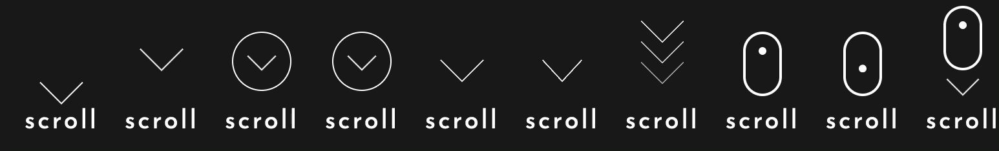

<div align="center">
<h1>react-scroll-element</h1>
<h2>
<a href="https://github.com/crisboarna/react-scroll-element/actions/workflows/merge_main.yaml">
  
</a>
<a href="https://snyk.io/test/github/crisboarna/react-scroll-element">
  
</a>
<a href="https://codecov.io/gh/crisboarna/react-scroll-element">
  
</a>
<a href="https://www.npmjs.com/package/react-scroll-element">
  
</a>
<a href="http://opensource.org/licenses/MIT">
  
</a>
<a href="https://github.com/semantic-release/semantic-release">
  
</a>
<a href="http://commitizen.github.io/cz-cli/">
  
</a>

<a href="https://github.com/crisboarna/react-scroll-element">
  
</a>
<a href="https://github.com/crisboarna/react-scroll-element">
  
</a>
<a href="https://github.com/crisboarna">
  
</a>
<a href="https://github.com/crisboarna/react-scroll-element/pulls">
  
</a>

</h2>
</div>

# Documentation & Demo
Documentation and demo can be found [here](https://crisboarna.github.io/react-scroll-element)

# Table of Contents

* [Installation](#installation)
* [Description](#description)
  * [Parameter naming](#parameter-naming)
* [Setup](#setup)
* [Development](#development)
  * [Linting](#linting)
  * [Testing](#testing)
* [How To Contribute](#how-to-contribute)
  * [Bots used](#bots-used)
* [License](#license)


# Installation
With `yarn`
```shell
yarn add react-scroll-element
```

or with `npm`
```shell
npm install react-scroll-element
```

# Setup
Import
```typescript
import ScrollElement from 'react-scroll-element';
```

# Development
## Linting
```shell
yarn lib:lint
```

## Testing
```shell
yarn lib:test
```
`jest` is used for as the testing framework.

# How to Contribute

1. Clone repo and create a new branch:
```shell
git checkout https://github.com/crisboarna/react-scroll-element -b name_for_new_branch`.
````
2. Make changes and test
3. Submit Pull Request with comprehensive description of changes

## Bots used
To facilitate development the following bots are integrated into the repository:
1. [Request Info](https://github.com/behaviorbot/request-info)
2. [Semantic Pull Requests](https://github.com/apps/semantic-pull-requests)
2. [Welcome](https://github.com/apps/welcome)
3. [Snyk](https://github.com/marketplace/snyk)
4. [Todo](https://github.com/apps/todo)

## License
[](https://creativecommons.org/publicdomain/zero/1.0/)

Full license details can be found in [LICENSE.md](./LICENSE.md)
